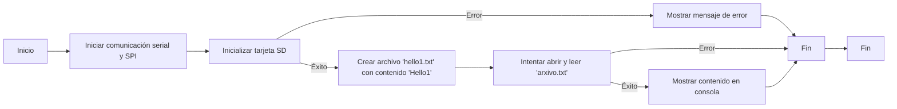
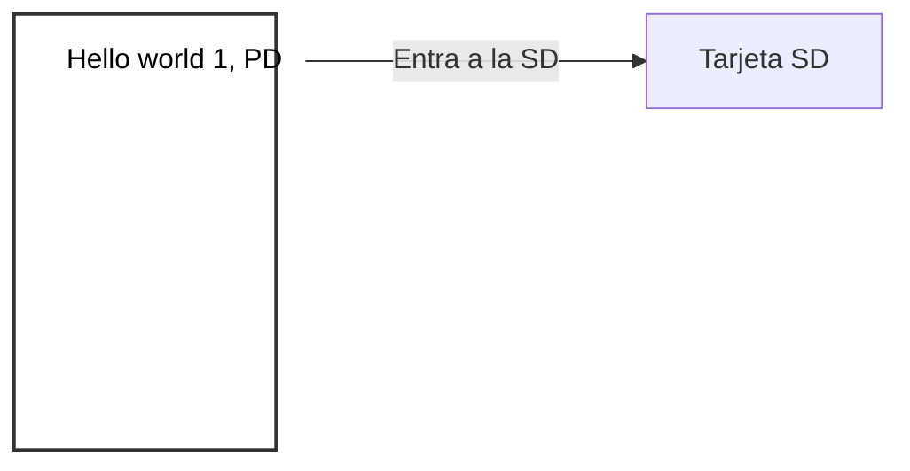

# Practica 6.A: Lectura y escritura de memoria SD.
## Objetivos: 
- Comprender el funcionamiento del bus spi.
- Leer y esctibir ficheros de una memoria SD.
## Materiales: 
- ESP32-S3
- Lector SD
- SD + funda
- Adaptador SD
## Procedimiento: 
**Codigo:**
```cpp
    #include <Arduino.h>
    //bool SDFS::begin(uint8_t ssPin, SPIClass &spi, uint32_t frequency, const char * mountpoint, uint8_t max_files, bool format_if_empty)
    //    void begin(int8_t sck=-1, int8_t miso=-1, int8_t mosi=-1, int8_t ss=-1);
    //  1000, "/sd", 5 ,true 

    #include <SPI.h>
    #include <SD.h>
    File myFile;
    //File file1;

    void writeFile(fs::FS &fs, const char * path, const char * message){
        Serial.printf("Writing file: %s\r\n", path);

        File file = fs.open(path, FILE_WRITE);
        if(!file){
            Serial.println("- failed to open file for writing");
            return;
        }
        if(file.print(message)){
            Serial.println("- file written");
        } else {
            Serial.println("- write failed");
        }
        file.close();
    }

    void setup()
    {
    Serial.begin(115200);
    SPI.begin(36, 37, 35);
    Serial.print("Iniciando SD ...");
    if (!SD.begin(39, SPI)) {
        Serial.println("No se pudo inicializar");
    return;
    }

    Serial.println("inicializacion exitosa");
    writeFile(SD, "/hello1.txt", "Hello world 1, PD"); 

    myFile = SD.open("/arxivo.txt");//abrimos el archivo 
    if (myFile) {
        Serial.println("arxivo.txt:");
    while (myFile.available()) {
        Serial.write(myFile.read());
    }
    myFile.close(); //cerramos el archivo
    } else {
        Serial.println("Error al abrir el arxivo");
    }
    }
    void loop()
    {
    }


```
**Descripción:** <br>
En este codigo se utiliza una tarjeta SD para escribir y leer archivos. Primero, se incluyen las bibliotecas necesarias, como SPI y SD. Luego, se define una función llamada ``writeFile()``, que toma un sistema de archivos (fs), una ruta de archivo y un mensaje para escribir en el archivo.
En la función ``setup()``, que se ejecuta una vez al inicio, se inicia la comunicación serial para la depuración, se configura la comunicación SPI y se intenta inicializar la tarjeta SD. Si la inicialización tiene éxito, se crea un archivo llamado ``"hello1.txt"`` con el contenido ``"Hello1"`` utilizando la función ``writeFile()``. Después, se intenta abrir y leer un archivo llamado ``"arxivo.txt"``, mostrando su contenido si se abre correctamente.

## Diagrama de flujos:



## Salida terminal: 
```
    Iniciando SD ... inicializacion exitosa
    Writing file: /hello.txt
    - file written 
    arxivo.txt:
    Assignatura -> Processadors digitals. Nom -> Núria
```

### Salida grafica archivo 'hello1.txt':


## Conclusión: 
El código establece la comunicación con la tarjeta SD, escribe en un archivo y luego lee desde otro archivo.